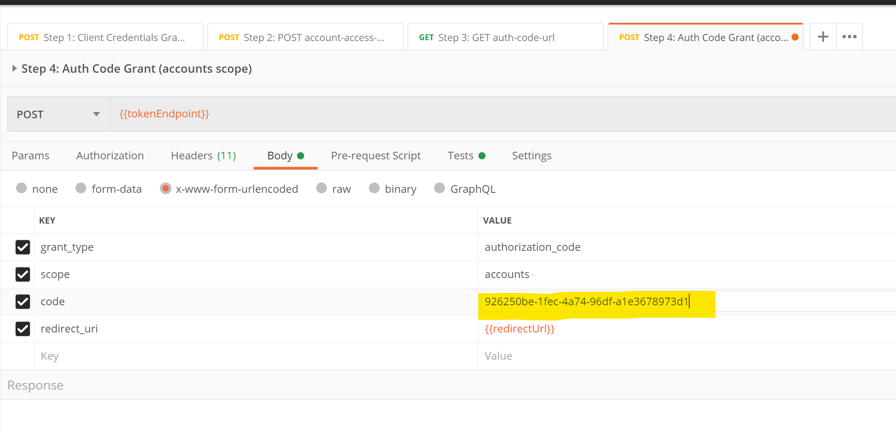

# Step-by-step Guide to using Postman

## Pre-requisites

Ensure that the following pre-requisites are met:

- You have registered on the sandbox and have a valid `client_id` and `client_secret` issued to you
- You have a valid transport certificate
- Your `redirect_uris` are correctly set up for your client
- You have downloaded the root certificate (pem file) for the TecBan Sandbox from [here](tbc)
- You have downloaded the postman collection for teh TecBan Sandbox from [here](tbc)

## Step 2 - Test your certificates

Test the well know endpoint below and ensure returns that it returns a json file

``` bash
curl https://ob-issuer1.tecban-sandbox.o3bank.co.uk/.well-known/openid-configuration
```

Next, hit the token endpoint to validate your certificates. (You will see a OIDC error, but this is to be expected at this stage)

``` bash
curl https://ob-issuer1.tecban-sandbox.o3bank.co.uk/token
-cacert ca.pem
-key {tpp-key-file}
-cert {tpp-pem-file}
```

Here, ttp-key-file is the file that contains the TPPs private key and tpp-cert-file contains the transport certificate.
The `ca.pem` is the root certificate file downloaded in Step 1

This will return an error response but proves that your certificates are valid against the MATLS endpoint.
Here, the ca.pem file contains the ob issuing and root certificate chained together into a single file.

## Step 3 - Download the postman environment file

Once a TPP successfully registers, they can download the environment file for their client.

To do this, first compute the token to be used:

``` javascript
token = base64Encode( client_id + ":" + client_secret);
```

Then, use curl to get hold of the environment file:

``` bash
curl https://ob-api2.tecban-sandbox.o3bank.co.uk:4502/ozone/v1.0/postman/environment
-cacert ca.pem
-key {tpp-key-file}
-cert {tpp-pem-file}
--header 'Authorization: Basic <<token>>'
```

On successful response the TPP can then save the environment file on to their local system.

## Step 4 - Configure Postman

- Start Postman and use the "Import" button to import in the postman collection and environment files.


- Check that the collection and environment are correctly loaded


- Add the client certificates
  - Set the `Host` field to `*.tecban-sandbox.o3bank.co.uk` 
  - Set the `Port` field to `*`


- Turn off CA Certicate Verification (or add the CA certificate as a trust root)


## Step 5 - Try out the AIS and PIS flows
You are all set up and ready to try the sequence of AIS and PIS flows.

In the TecBan collection, see the "Sequence" folder and execute each of the API calls in the correct order.

At Step 3, copy the URL and paste it in a web browser. This will emulate the authentication flow user interface.


Complete the authentication flow.


Once the flow is completed, the browser will display an authorization code. Copy this and paste into Step 4 in Postman.



This generates an access token. Continue to the subsequent steps in the postman collection.