# Usage Guide

This document explains how TPPs can integrate with the Tecban servers and make payments and access account information. 

## Table of Contents

  - [Initial Setup](#markdown-header-initial-setup)
  - [Accessing Accounts](#markdown-header-accessing-accounts)
  - [Making Payments](#markdown-header-making-payments)
  - [Changing Redirect URL](#markdown-header-changing-redirect-url)

## Initial Setup

### Step 1 - Register with TecBan

Before integrating with TecBan TPPs must first register a client with TecBan. 
To simplify this step, Tecban already has a few test clients registered. TPPs can pick one of the clients for their integration purposes. 

The list of registered clients can be found [here](../test%20clients/README.md)

### Step 2 - Setup postman

####  Download postman

[Postman](https://www.postman.com) can be used to test the flows and APIs out prior to building a TPP client. 

#### Postman collection files
 
Download and import the postman collection files from [here](./files/postman-collection.json)

#### Environment files
 
Download and import the environment file related to the client from [here](../test%20clients/README.md)

Set this as the postman environment.

#### Add Client Certificates
 
Setup client certificates as per below 

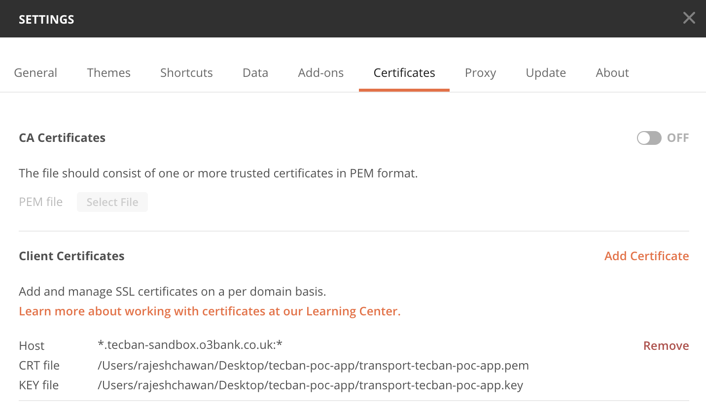

## Accessing Accounts

### Step 1 - Client Credentials Grant

TPPs can hit the token endpoint to obtain a client credential token. 

The token endpoint for tecban is https://as1.tecban-sandbox.o3bank.co.uk/token

This endpoint can be found in postman collection under the "OpenID Connect folder" 

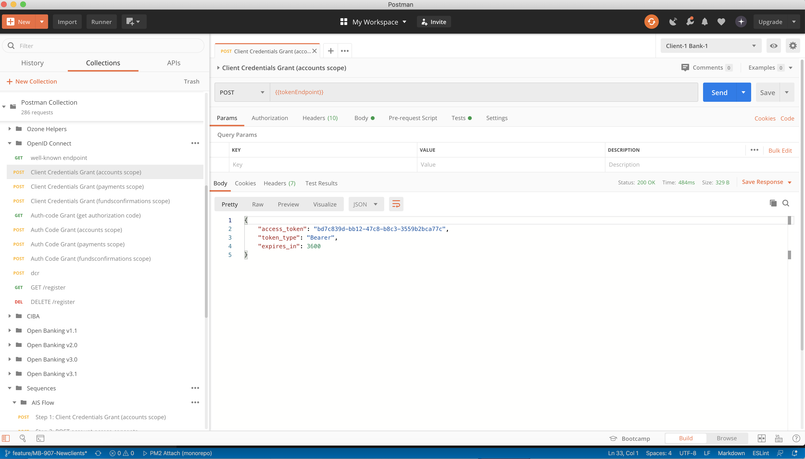

### Step 2 - Account Access Consent

Once TPPs obtain the client credential token, they can then hit the account access endpoint to generate a consent ID

The endpoint for tecban is https://rs1.tecban-sandbox.o3bank.co.uk/open-banking/v3.1/aisp/account-access-consents

This endpoint can be found in postman collection under the "Open Banking 3.1/Account & Transaction Information v3.1/account-access-consent" 

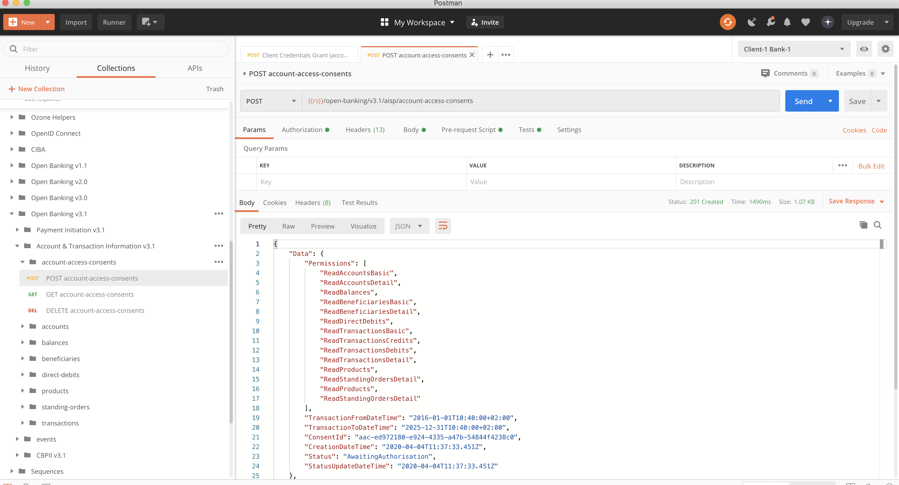

### Step 3 - PSU Consent URL

Using the consent ID generated above, TPPs then need to generate an authorization code URL so that users can give consent.

There is a helper endpoint provide to achieve the URL

This endpoint can be found in postman collection under the "Ozone Helpers/auth-code-url" 

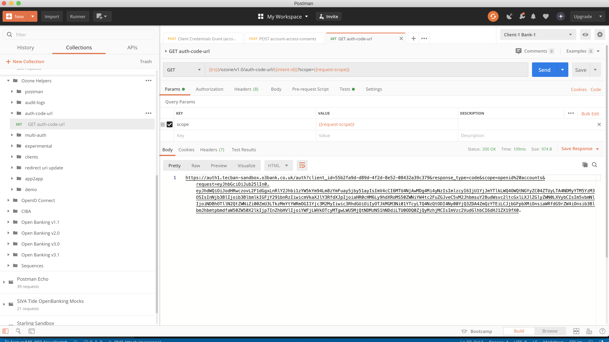

### Step 4 - Authorize Consent

Users should be directed to the consent URL generated above. Once users login and select the accounts they want to authorize, TPPs will be redirected to the redirect URL registered along with a code.

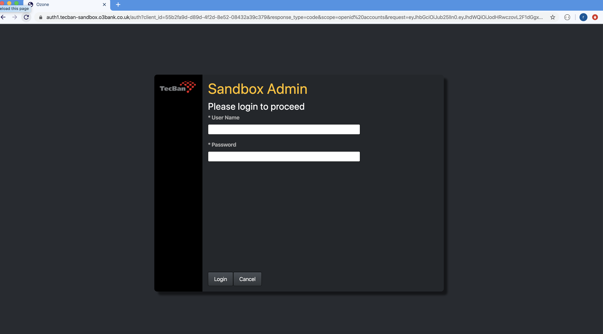

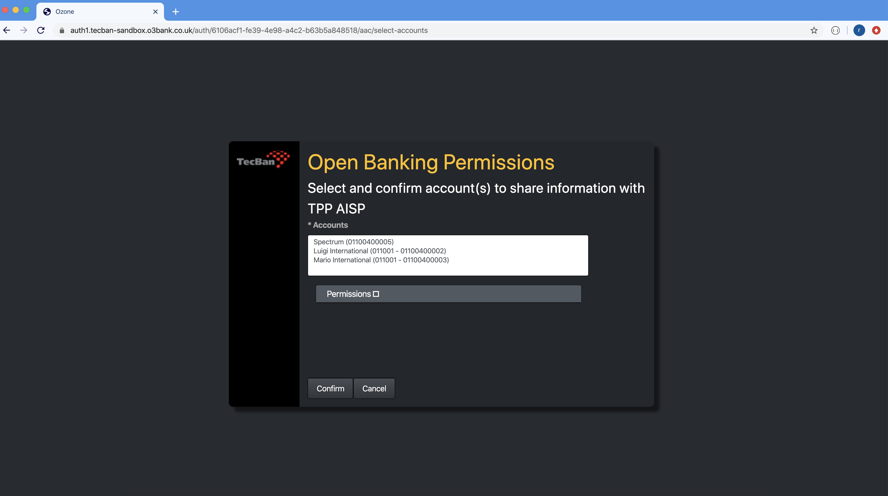

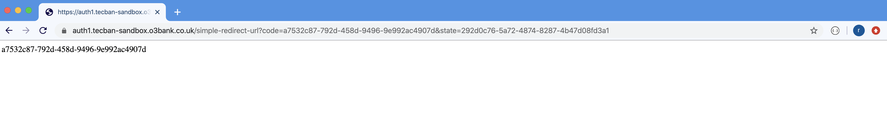

### Step 5 - Authorization Code Grant

Using the code obtained above, TPPs then need to call the token endpoint again to generate an authorization code grant

The token endpoint for tecban is https://as1.tecban-sandbox.o3bank.co.uk/token

This endpoint can be found in postman collection under the "OpenID Connect folder" 

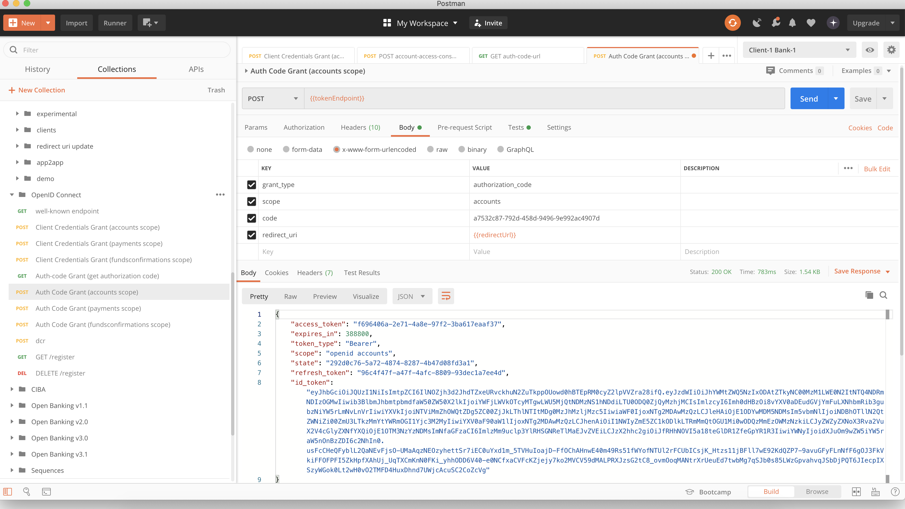

### Step 6 - Access Accounts

Once TPPs obtain the authorization code token, they can then hit the accounts endpoint and obtain information about users account

The endpoint for tecban is https://rs1.tecban-sandbox.o3bank.co.uk/open-banking/v3.1/aisp/account-access-consents

This endpoint can be found in postman collection under the "Open Banking 3.1/Account & Transaction Information v3.1/accounts" 

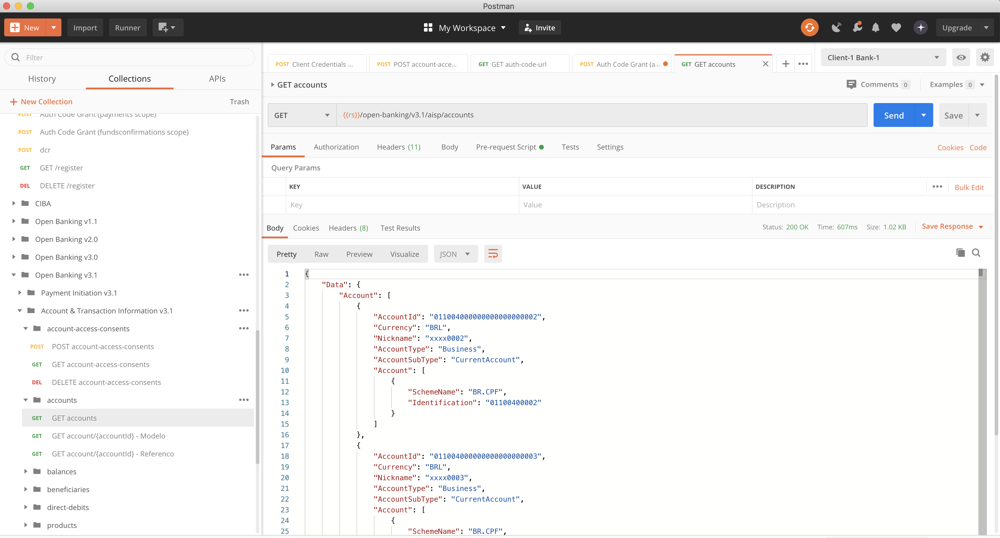

## Making Payments

### Step 1 - Client Credentials Grant

TPPs can hit the token endpoint to obtain a client credential token. 

The token endpoint for tecban is https://as1.tecban-sandbox.o3bank.co.uk/token

This endpoint can be found in postman collection under the "OpenID Connect folder" 

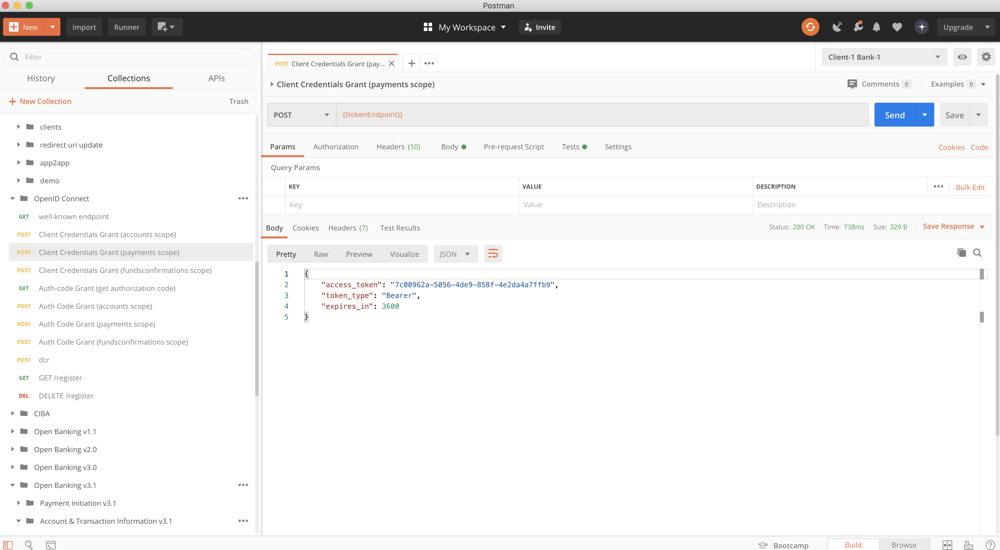

### Step 2 - Domestic Payments Consent

Once TPPs obtain the client credential token, they can then hit the account access endpoint to generate a consent ID

The endpoint for tecban is https://rs1.tecban-sandbox.o3bank.co.uk/open-banking/v3.1/pisp/domestic-payment-consents

This endpoint can be found in postman collection under the "Open Banking 3.1/Payment Initiation v3.1/Domestic Payments" 

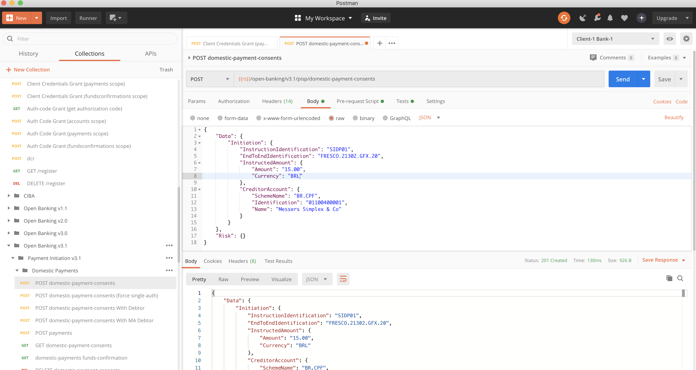

### Step 3 - PSU Consent URL

Using the consent ID generated above, TPPs then need to generate an authorization code URL so that users can give consent.

There is a helper endpoint provide to achieve the URL

This endpoint can be found in postman collection under the "Ozone Helpers/auth-code-url" 

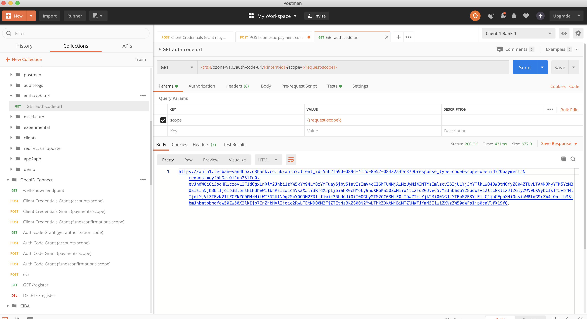

### Step 4 - Authorize Consent

Users should be directed to the consent URL generated above. Once users login and select the accounts which they want to use to make the payment, TPPs will be redirected to the redirect URL registered along with a code.

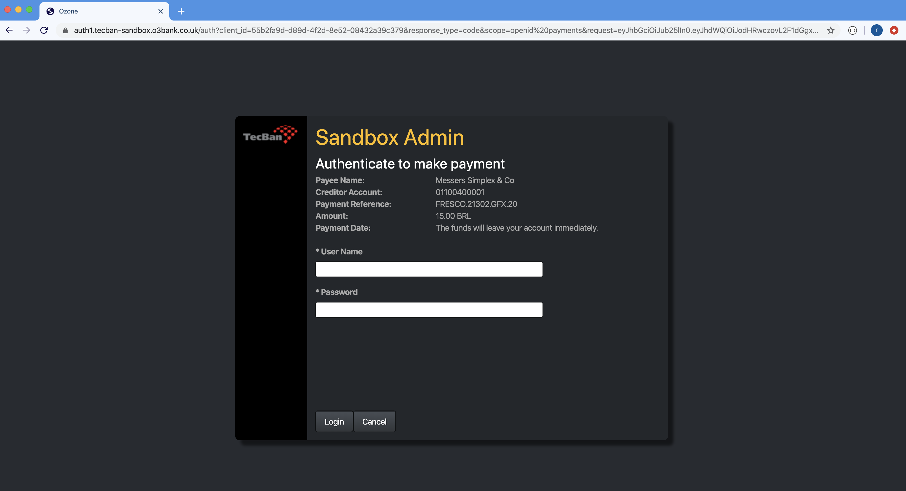

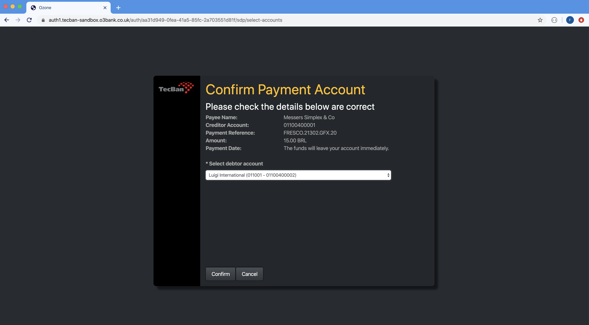

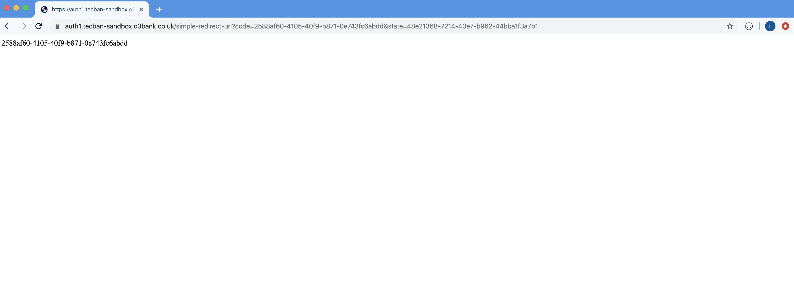

### Step 5 - Authorization Code Grant

Using the code obtained above, TPPs then need to call the token endpoint again to generate an authorization code grant

The token endpoint for tecban is https://as1.tecban-sandbox.o3bank.co.uk/token

This endpoint can be found in postman collection under the "OpenID Connect folder" 

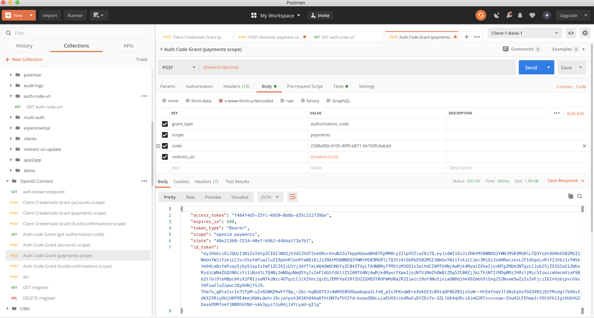

### Step 6 - Payment Submission

Once TPPs obtain the authorization code token, they can then hit the payment submission endpoint and complete the payment

The endpoint for tecban is https://rs1.tecban-sandbox.o3bank.co.uk/open-banking/v3.1/pisp/domestic-payments

This endpoint can be found in postman collection under the "Open Banking 3.1/Payment Initiation v3.1/Domestic Payments" 

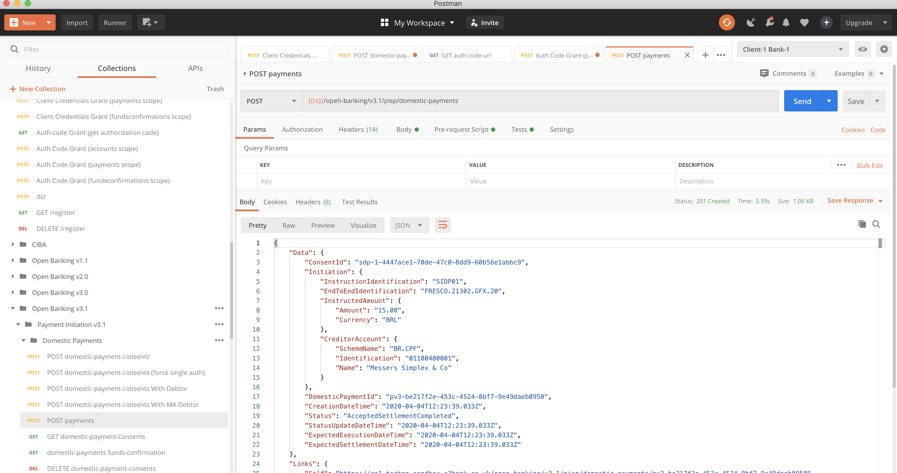

## Changing Redirect URL

All clients are configured with some default redirect URLs. TPPs can change the redirect URL using a helper endpoint provided in the postman collection.

The endpoint for tecban is https://rs1.tecban-sandbox.o3bank.co.uk/ozone/v1.0/redirect-url-update

This endpoint can be found in postman collection under the "Ozone Helpers/redirect uri update" 

The redirectURL parameter accepts a comma separated list of redirect URIs

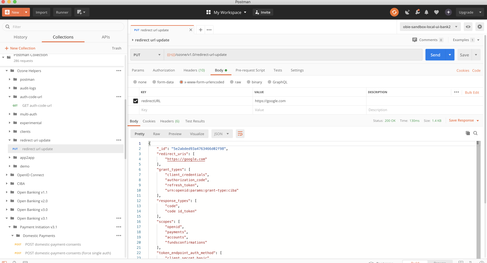